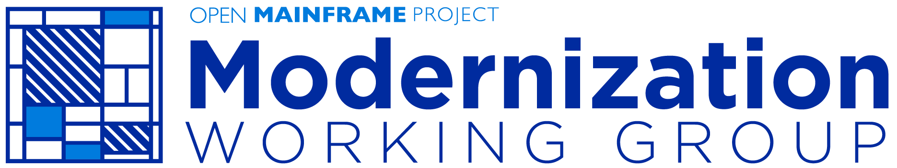

# Modernization Workgroup

**The Modernization Working Group** will create a common definition and framework around modernization in the mainframe space; produce educational material and promote all messages and definitions wider landscape for better alignment.

<!--Goals of the WG are:

1. _goal 1_
2. ...

_Non-goals are things that the working group are intentionally choosing not to do, the things not expected to change due to the working groups efforts, or the subject matter areas that the working groups doesn’t want to address at this time. _

Non-goals of the WG are:

1. _non goal 1_
2. ... -->

The TAC member sponsor of this working group is _TAC sponsor name_

## Deliverables

_provide a list of planned deliverables, or links to the deliverables. A best practice is to have a directory named [deliverables](deliverables) in the repo for hosting and managing deliverables._

## Communication

This WG communicates on the following channels:

- _link to mailing list_https://lists.openmainframeproject.org/g/wg-mainframe-modernization
- _slack channel_#wg-modernization
- _any other channels_
...

## Meetings

See the [Open Mainframe Project public calendar](https://calendar.openmainframeproject.org). This WG meets _meeting day/time and frequency_. 

_provide the Zoom/conference call details_

## In-person meetings

_list if applicable, or skip if not_

## Meeting notes

Meeting notes, recordings, and any presentations made during WG meetings are available [here](meetings).
